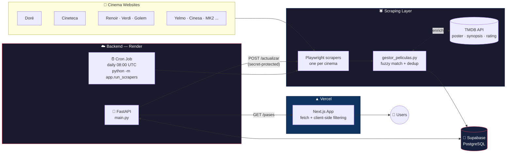

# 🎬 FPS24 — Independent Cinema Listings for Madrid

FPS24 aggregates showtimes from Madrid's independent, arthouse, and original-language (VOSE) cinemas — Doré, Cineteca, Sala Equis, the Renoir chain, Verdi, Golem, Embajadores, MK2 Palacio de Hielo, Cine Paz, Yelmo Ideal, Cinesa, Palacio de la Prensa, and more — into a single, searchable listing, with movie data automatically enriched via TMDB.

🔗 **Live site:** [fps24.es](https://fps24.es)

---

## 🧱 Architecture



- **Backend:** FastAPI + SQLModel, PostgreSQL hosted on Supabase.
- **Scrapers:** Playwright (headless Chromium), one module per cinema, orchestrated by `run_scrapers.py`.
- **Data enrichment:** TMDB integration (poster, synopsis, rating, year, runtime, YouTube trailer, image gallery).
- **Deduplication:** `gestor_peliculas.py` resolves whether a movie already exists via exact match + fuzzy matching (`thefuzz`) before creating a new entry or querying TMDB.
- **Automation:** a Render Cron Job runs `python -m app.run_scrapers` daily, executing the full scrape-and-repopulate pipeline.
- **Frontend:** Next.js (App Router), fetches from the API and handles filtering/grouping client-side.
- **Deploy:** Vercel (frontend, auto-deploy on push to `main`) + Render (backend + cron job).

---

## 📂 Repository structure

```
fps24/
├── backend/
│   ├── app/
│   │   ├── core/
│   │   ├── database/
│   │   │   ├── engine.py       # DB connection (Supabase / local SQLite fallback)
│   │   │   └── models.py       # SQLModel models: Pelicula, Pase
│   │   ├── scrapers/
│   │   │   └── cines/          # One Playwright scraper per cinema
│   │   ├── services/
│   │   │   ├── gestor_peliculas.py  # Dedup + TMDB resolution
│   │   │   └── tmdb.py              # TMDB API client
│   │   ├── run_scrapers.py     # Orchestrator: wipes DB and reruns all scrapers
│   │   └── main.py             # FastAPI app and endpoints
│   ├── crear_tablas.py         # Local setup utility
│   ├── ver_db.py               # Local inspection utility
│   ├── database.db             # Local SQLite (tests only, never used in production)
│   └── requirements.txt
└── frontend/
    └── src/
        ├── app/
        │   ├── page.js          # Main page: fetch, filters, grouping
        │   ├── layout.js         # Root layout, fonts, Google Analytics
        │   ├── cines/
        │   └── pelicula/
        ├── components/
        ├── lib/
        └── utils/
```

---

## ⚙️ How the data pipeline works

1. **Scraping:** each scraper in `app/scrapers/cines/` visits a cinema's website with Playwright and extracts title, showtimes, language (VOSE/dubbed), and booking link.
2. **Movie resolution:** for every extracted title, `gestor_peliculas.obtener_id_pelicula()`:
   - Looks for an exact match in the database.
   - Falls back to fuzzy matching (85% threshold) against existing movies.
   - If still no match, queries TMDB and creates a new `Pelicula` with the returned metadata.
3. **Special-event detection:** `determinar_si_es_especial()` flags a showing as "special" if the title contains keywords (cycles, marathons, revivals) or if the movie predates 2023.
4. **Persistence:** each `Pase` (showing) is saved with deduplication by cinema + movie + datetime.
5. **Exposure:** `GET /pases` returns all showings with their associated movie (`selectinload`), consumed by the frontend.

### Data refresh

The full pipeline (`lanzar_todo()` in `run_scrapers.py`) **wipes all showings and movies** and repopulates the database from scratch. It's triggered through two equivalent paths that call the exact same function:

| Trigger | Description |
|---|---|
| **Cron (Render)** | Scheduled job running `python -m app.run_scrapers` directly, daily at 08:00 UTC. Doesn't go through HTTP. |
| **HTTP endpoint** | `POST /actualizar`, protected with an `X-Actualizar-Secret` header. Meant for manual triggering (not used by the cron). Runs as a background task. |

> ⚠️ Because this is a wipe-and-repopulate pattern, a failure mid-run can leave the database incomplete until the next scheduled run.

---

## 🚀 Local development

### Backend

```bash
cd backend
python -m venv venv
source venv/bin/activate  # Windows: venv\Scripts\activate
pip install -r requirements.txt
playwright install chromium

# .env
# DATABASE_URL=postgresql://... (omit to fall back to local SQLite)

uvicorn main:app --reload
```

Without `DATABASE_URL` set, the backend automatically falls back to `sqlite:///database.db` — it never points at production by default.

### Frontend

```bash
cd frontend
npm install

# .env.local
# NEXT_PUBLIC_API_URL=http://localhost:8000

npm run dev
```

### Running scrapers manually

```bash
cd backend
python -m app.run_scrapers
```

---

## 🔐 Environment variables

### Backend (Render / `.env`)

| Variable | Description |
|---|---|
| `DATABASE_URL` | Supabase (Postgres) connection string. Falls back to local SQLite if unset. |
| `ACTUALIZAR_SECRET` | Secret required in the `X-Actualizar-Secret` header to call `POST /actualizar`. |

### Frontend (Vercel / `.env.local`)

| Variable | Description |
|---|---|
| `NEXT_PUBLIC_API_URL` | Base URL of the FastAPI backend. Falls back to `http://localhost:8000` if unset. |

---

## 🗺️ Roadmap

- [ ] More detailed logging in scrapers' silent `except` blocks, to catch individual failures without losing resilience.
- [ ] Incremental updates instead of full wipe-and-repopulate.
- [ ] Restrict CORS to actual production domains instead of `*`.
- [ ] Protect the `/test/*` endpoints.

---

## 📄 License

Personal project — no public license defined.
